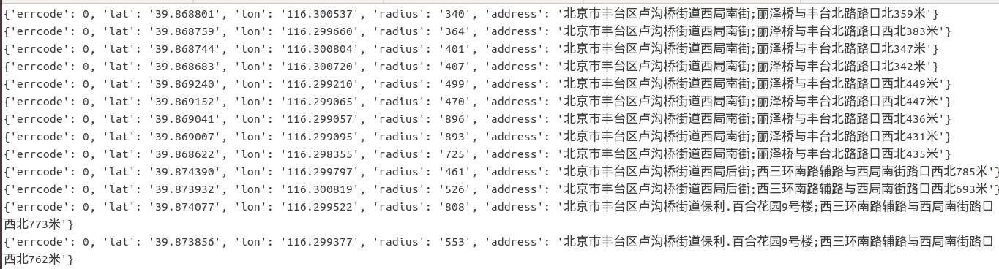
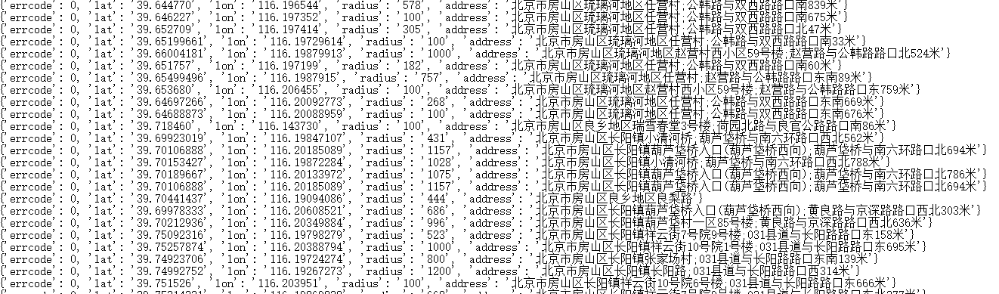

# BS/AP location
This directory contains code for obtaining BS/AP location information and data filtering.

## Requirements
* python3

## Usage

Obtain the location information of base station in Beijing.
> python3 bsLoc.py

Obtain the location information of access point in Beijing.
> python3 apLoc.py

## Data Format

Access point.
[APLOC]

Base station
[BSLOC]
